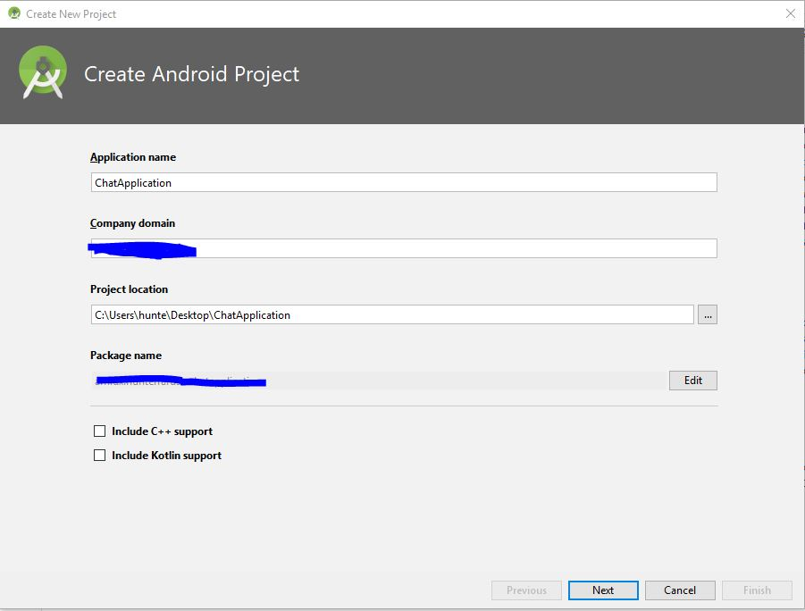
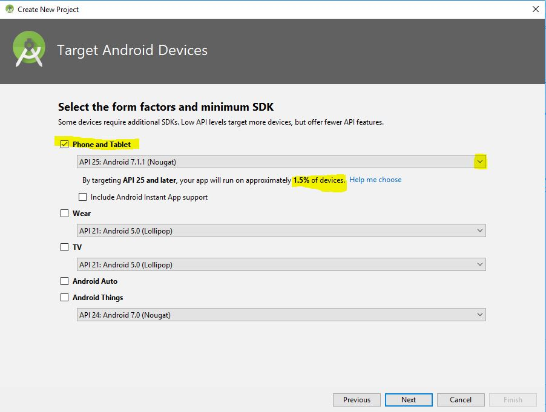
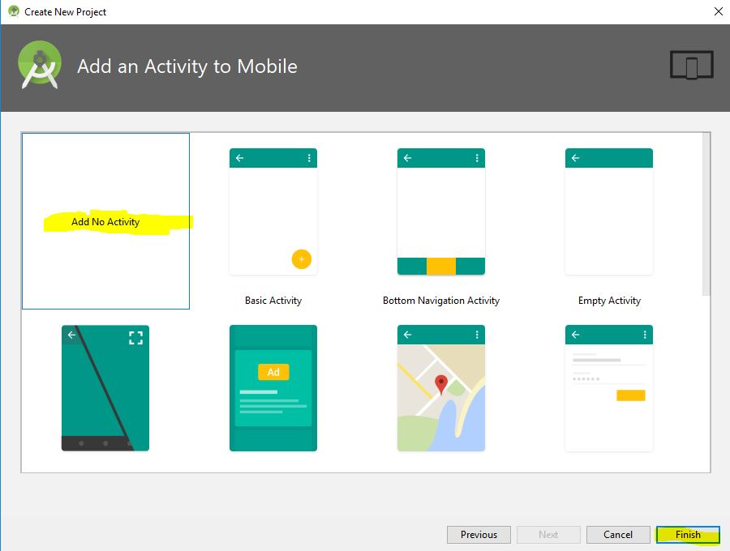

# ChatApp-with-Gradle-Android
A react-native application created for Android devices.

## ChatApplication with Gradle first steps:
So let's dive right in! Before gradle came about, developers created applications with Eclipse which nine times out of ten most developers didn't build an APK(Android Application Package) without Eclipse. Instead of having to maticulously implement CMD code to create an application with jargon such as dx and aapt that derives from within the SDK(software development kit)Gradle is implemented by Android Studio. Which creates an exact foundation for your android application without the hassle of creating specifications on your own which in turn makes meeting deadlines faster and less stressful. With little to no knowledge about Android Development in general, this little language called Gradle can set you on the path to creating complex and amazing web apps. So let's begin by downloading the Link <a href="https://www.google.fi/url?sa=t&rct=j&q=&esrc=s&source=web&cd=1&cad=rja&uact=8&ved=0ahUKEwjT4aL3-q_aAhUEP5oKHWNGA_IQFggoMAA&url=https%3A%2F%2Fdeveloper.android.com%2Fstudio%2Findex.html&usg=AOvVaw3Sc79X2kzVV5Vj7s0ljRel"> here</a>.

It makes things a lot easier when you take a look at the <a href="https://developer.android.com/studio/intro/index.html">Docs</a> and the latest <a href="https://developer.android.com/studio/releases/index.html">release notes</a> just to make sure that any syntax changes or new syntax for example is known and understood before moving on. A quick skim is great, if not just save it for later. So after we have that downloaded let's install the Android Studio Application and when it's finished we should see a pop up like so:

Let's go ahead and create a new android application. When you click it, a pop up will appear and ask you to fill out some much needed information. You can name it whatever you like, for the sake of this tutorial, let's go ahead and go with ChatApplication.

In this case we don't need Kotlin support or any other support. If you have a company website, you can implement that but if you don't just leave the default. It won't really change anything. Now when we click next we get this beauty.

So I chose Nouget as my build is actually Oreo for my phone's software. It is a long shot but if you do have that release then go ahead but to be on the safe side I recommend choosing Lollipop. Just for the sake of not running into too many bugs on the way.

Now you see an activity page and may be asking yourself the same thing many others do when starting with an Android Project. What is an Android Activity? Well if you can't get the hint from the images, it's basically a single screen with a user interface just like window or frame in Java. You can learn more about activities on the Android Developer page dedicated to all things Android and about activities <a href="https://developer.android.com/reference/android/app/Activity.html">here</a>.
