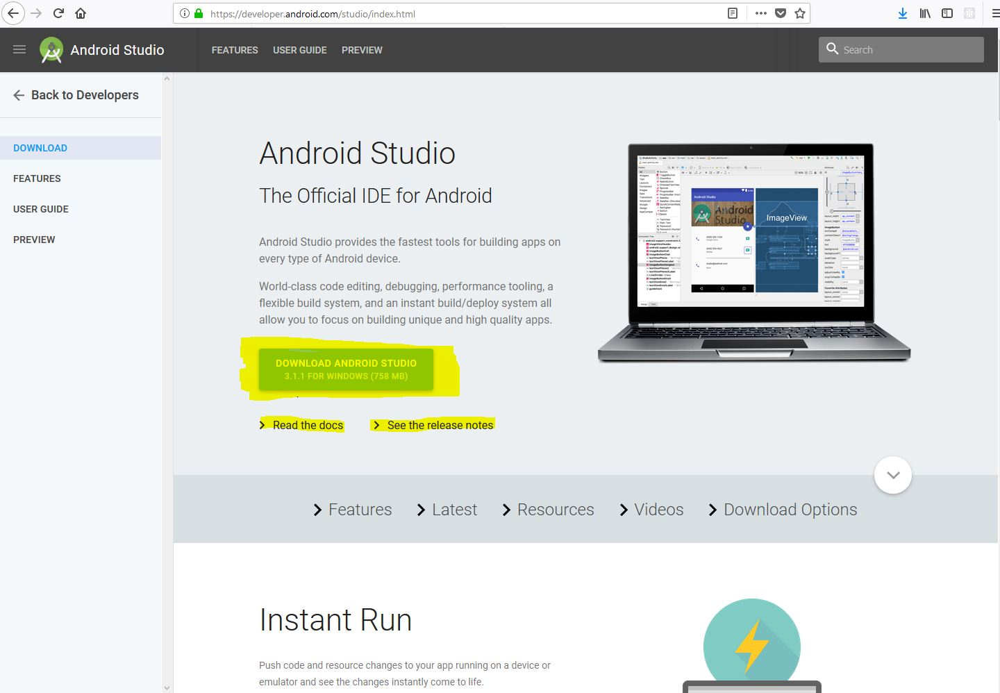

# ChatApp-with-Gradle-Android
A react-native application created for Android devices.

## ChatApplication with Gradle & React first steps:
So let's dive right in! Before gradle came about, developers created applications with Eclipse which nine times out of ten most developers didn't build an APK(Android Application Package) without Eclipse. Instead of having to maticulously implement CMD code to create an application with jargon such as dx and aapt that derives from within the SDK(software development kit)Gradle is implemented by Android Studio. Which creates an exact foundation for your android application without the hassle of creating specifications on your own which in turn makes meeting deadlines faster and less stressful. With little to no knowledge about Android Development in general, this little language called Gradle can set you on the path to creating complex and amazing web apps. So let's begin by downloading the Link <a href="https://www.google.fi/url?sa=t&rct=j&q=&esrc=s&source=web&cd=1&cad=rja&uact=8&ved=0ahUKEwjT4aL3-q_aAhUEP5oKHWNGA_IQFggoMAA&url=https%3A%2F%2Fdeveloper.android.com%2Fstudio%2Findex.html&usg=AOvVaw3Sc79X2kzVV5Vj7s0ljRel"> here</a>.



It makes things a lot easier when you take a look at the <a href="https://developer.android.com/studio/intro/index.html">Docs</a> and the latest <a href="https://developer.android.com/studio/releases/index.html">release notes</a> just to make sure that any syntax changes or new syntax for example is known and understood before moving on. A quick skim is great, if not just save it for later. So after we have that downloaded let's install the Android Studio Application and when it's finished we should see a pop up like so:


Let's go ahead and create a new android application. Minus your Android Studio to your taskbar and bring up your command prompt. Unfortunately if you are following on a Mac I recommend waiting until I release a separate build or if you have a spare powerhouse, that being Windows, then by all means stop now and switch to Windows. Open your command prompt, yes CMD is just fine or whatever one you use is great as long as it gets the job done. Now this being a React Native Application, we need to create the neccessary dependencies for all things React. Let's start navigating to your directory, if you're new to that just find where it is in your File Explorer and, since mine is on my Desktop, navigate like so 

```
C:\Users\user> cd Desktop/
```

and it should come out to this:

```
C:\Users\user\Desktop\>
```
Now let's run 
```
react-native init ChatApp

```
When you initiate the ``init`` command it will automatically create a directory called 'ChatApp' within, for example, Desktop and download your dependencies. Like so:


Let's go ahead and give it a minute as it does take time to install all the neccessary files for this project.
